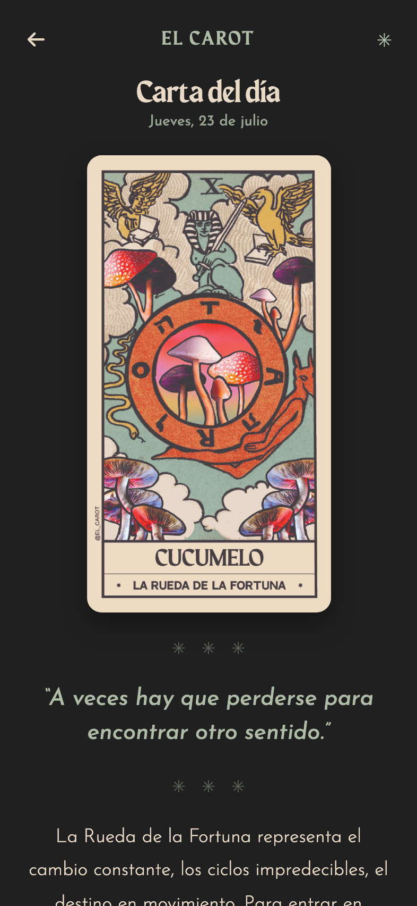
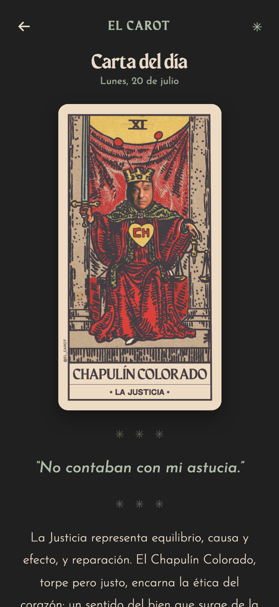
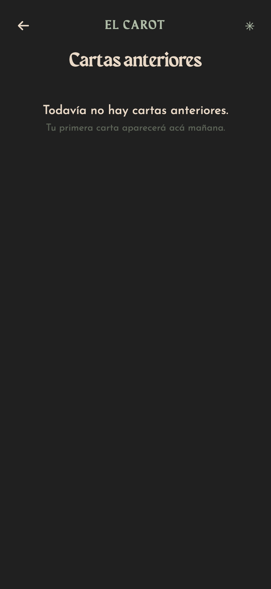
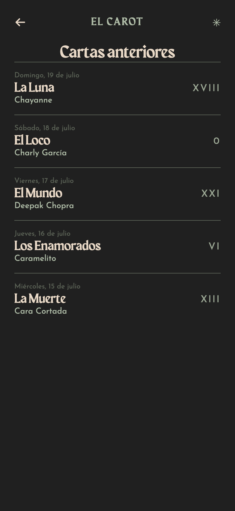
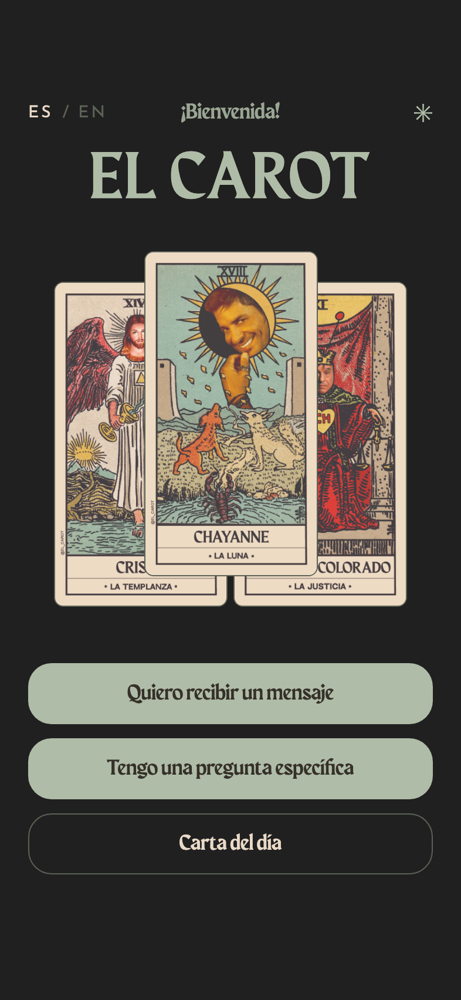
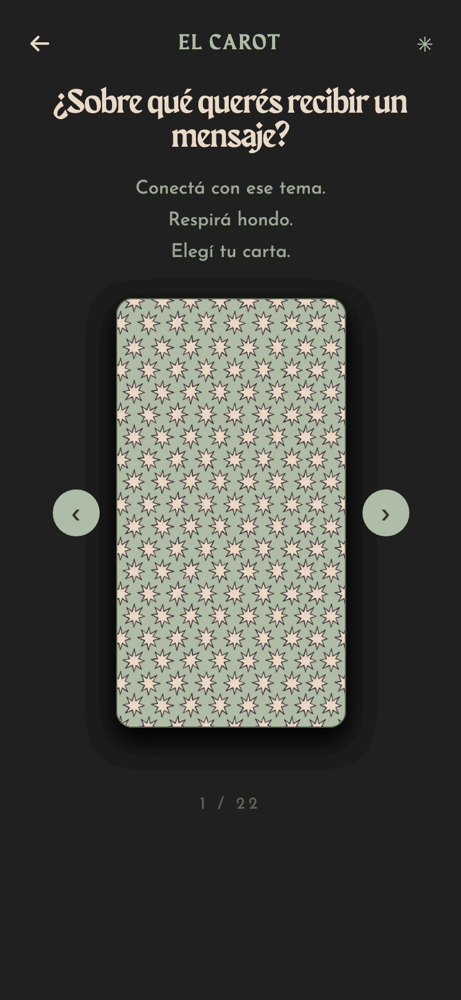
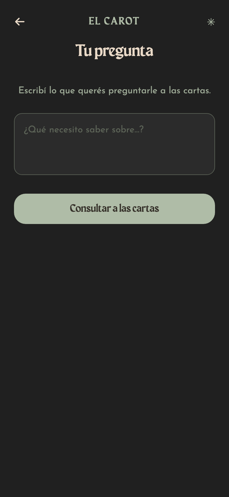
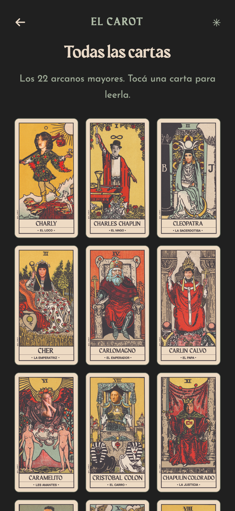

# El Carot

A tarot app for the phone, built on a bilingual deck of the 22 major arcana —
each one a familiar face. Draw a card for an open message, ask it a specific
question, or come back for the card of the day, which is pinned to the date and
cannot be rerolled.

Everything runs on the device: draws are local, the question you type never
leaves the phone, and there is no backend.

## Setup

```bash
npm run setup
```

No API keys or services to configure — a fresh clone runs with
`git clone` → `npm run setup` → `npm run dev`.

## Development

Start the Expo dev server (web):

```bash
npm run dev
```

For native platforms:

```bash
npm run ios      # iOS simulator
npm run android  # Android emulator
```

## Using CodeYam Editor

This project was built with [CodeYam](https://codeyam.com). To launch the editor:

```bash
codeyam editor
```

## Scripts

| Script            | Description                 |
| ----------------- | --------------------------- |
| `npm run setup`   | Install dependencies        |
| `npm run dev`     | Start Expo dev server (web) |
| `npm run ios`     | Run on iOS simulator        |
| `npm run android` | Run on Android emulator     |

<!-- codeyam:run-and-edit:start -->
## Develop this project with codeyam-editor

This project is built with [codeyam-editor](https://codeyam.com) — code and runnable data scenarios are authored side by side against a live preview.

```bash
# Clone the repo
git clone https://github.com/Dani-CodeYam/carot-mobile && cd carot-mobile

# Install codeyam-editor
npm install -g @codeyam-editor/codeyam-editor@latest

# Launch the editor (split-screen terminal + live preview)
codeyam-editor editor
```
<!-- codeyam:run-and-edit:end -->

<!-- codeyam:scenario-gallery:start -->
## Scenario gallery

States captured as runnable scenarios with codeyam-editor:

### Carta del día



### Carta del día - Revelada



### Cartas anteriores



### Cartas anteriores - Con historial



### Home



### Quiero recibir un mensaje



### Tengo una pregunta específica



### Todas las cartas


<!-- codeyam:scenario-gallery:end -->
