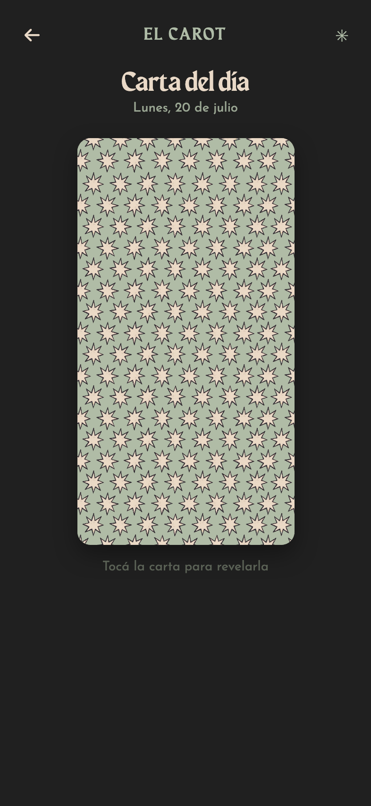
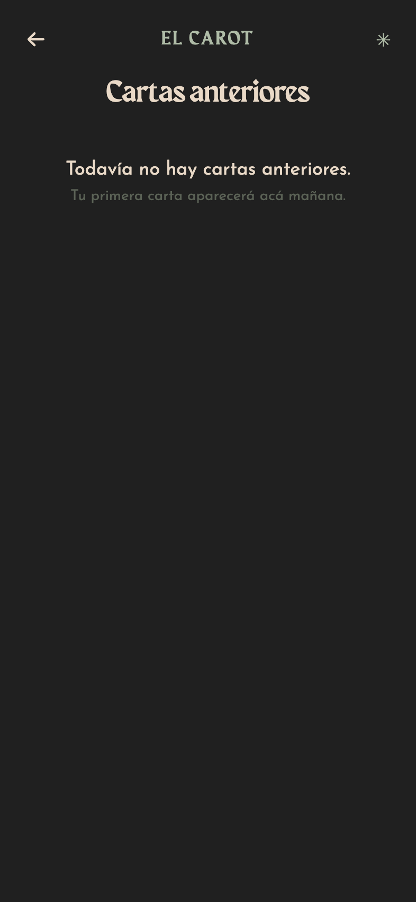
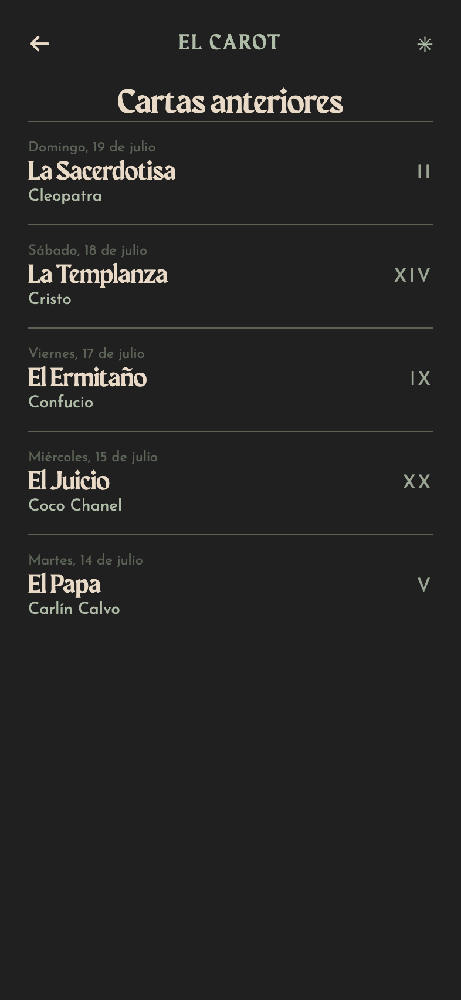
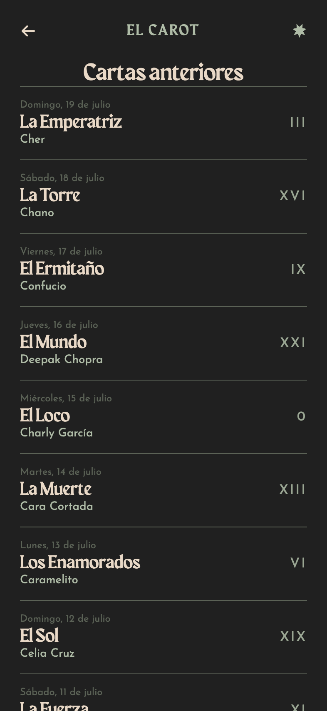
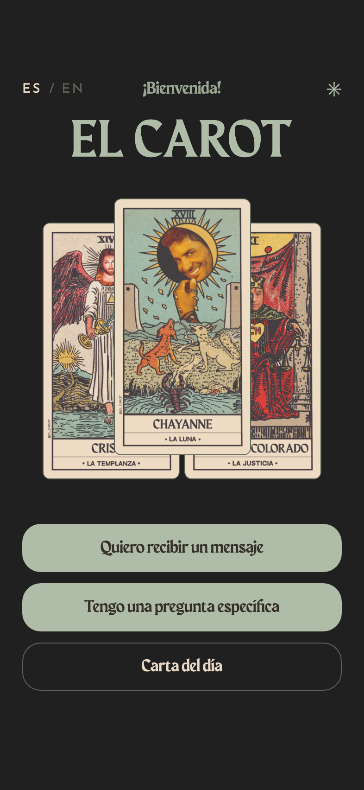

# El Carot

A tarot app for the phone, built on a bilingual deck of the 22 major arcana —
each one a familiar face. Draw a card for an open message, ask it a specific
question, or come back for the card of the day, which is pinned to the date and
cannot be rerolled.

Everything runs on the device: draws are local, the question you type never
leaves the phone, and there is no backend. Signing in with Apple or Google is
offered but never required — the whole app works without an account, and an
account only adds your name to the greeting and keeps your cards in their own
drawer.

## Setup

```bash
npm run setup
```

No API keys or services to configure — a fresh clone runs with
`git clone` → `npm run setup` → `npm run dev`.

### Signing in

The app is complete without an account; signing in only adds your name to the
greeting and a drawer of your own for your cards.

- **Apple** — needs a paid Apple Developer membership to enable the Sign in with
  Apple capability. `app.json` already declares the plugin and
  `ios.usesAppleSignIn`, so `npx expo prebuild` emits the entitlement. Apple's
  button is iOS-only and is always disabled on web and Android.
- **Google, iOS** — configured. The client id lives in `app.json` under
  `extra.googleIosClientId`, and its REVERSED form is the second entry of
  `scheme`. Those two are the same value in two shapes: change one and you must
  change the other, or Google answers `redirect_uri_mismatch`. They live
  together in one file for exactly that reason — an id in the environment and a
  scheme in `app.json` drifted silently.
- **Google, Android and web** — still unconfigured, so the button stays disabled
  there and says so. Supply `EXPO_PUBLIC_GOOGLE_ANDROID_CLIENT_ID` /
  `EXPO_PUBLIC_GOOGLE_WEB_CLIENT_ID` to enable them.

Neither provider authenticates in the web preview — native sign-in needs a real
device or simulator build. The signed-in states are shown in the preview through
seeded scenarios instead.

## Development

Start the Expo dev server (web):

```bash
npm run dev
```

For native platforms:

```bash
npm run ios      # iOS simulator
npm run android  # Android emulator
```

Building onto a real iPhone needs a signing team and a couple of flags that
`expo run:ios` omits — see `MOBILE_SETUP.md`. Shipping to the App Store,
including the Pre-Order flow, is in `RELEASE.md`, and the listing copy, privacy
policy and screenshots live in `store/`.

## Using CodeYam Editor

This project was built with [CodeYam](https://codeyam.com). To launch the editor:

```bash
codeyam editor
```

## Scripts

| Script            | Description                 |
| ----------------- | --------------------------- |
| `npm run setup`   | Install dependencies        |
| `npm run dev`     | Start Expo dev server (web) |
| `npm run ios`     | Run on iOS simulator        |
| `npm run android` | Run on Android emulator     |

<!-- codeyam:run-and-edit:start -->
## Develop this project with codeyam-editor

This project is built with [codeyam-editor](https://codeyam.com) — code and runnable data scenarios are authored side by side against a live preview.

```bash
# Clone the repo
git clone https://github.com/Dani-CodeYam/carot-mobile && cd carot-mobile

# Install codeyam-editor
npm install -g @codeyam-editor/codeyam-editor@latest

# Launch the editor (split-screen terminal + live preview)
codeyam-editor editor
```
<!-- codeyam:run-and-edit:end -->

<!-- codeyam:scenario-gallery:start -->
## Scenario gallery

States captured as runnable scenarios with codeyam-editor:

### Carta del día



### Carta del día - Revelada


### Cartas anteriores



### Cartas anteriores - Con cuenta



### Cartas anteriores - Con historial


### Cartas anteriores - Un mes



### Cartas anteriores - Una sola


### Home


<!-- codeyam:scenario-gallery:end -->
